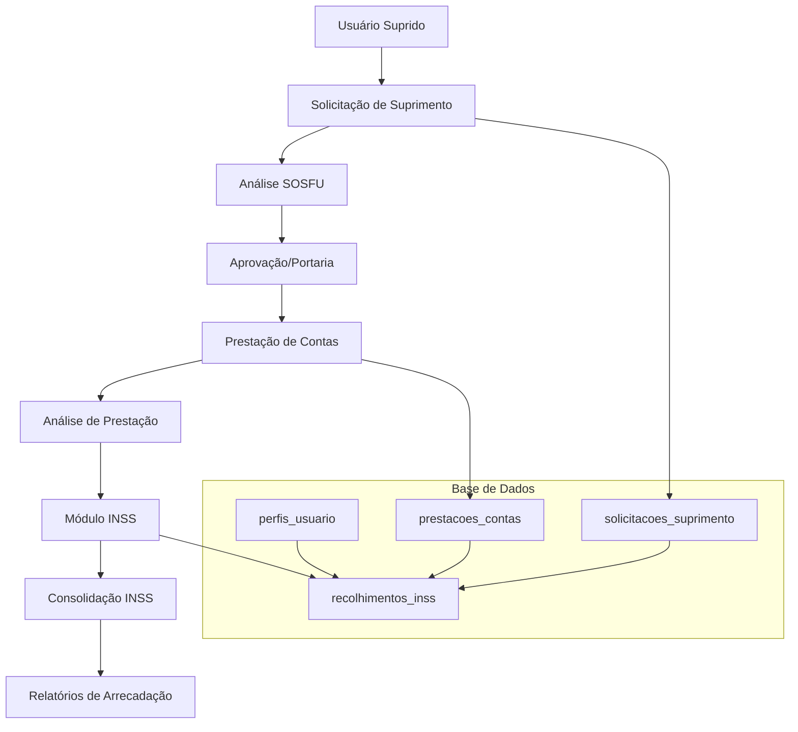
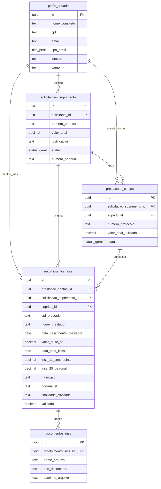
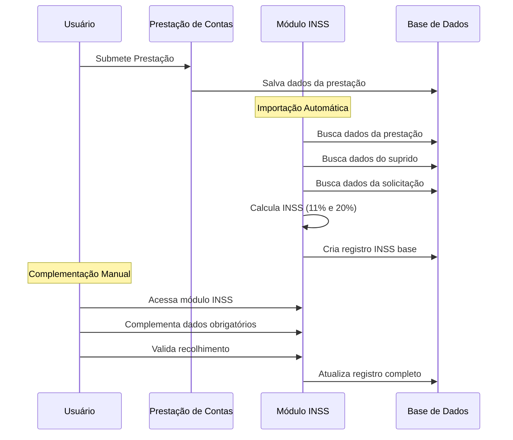
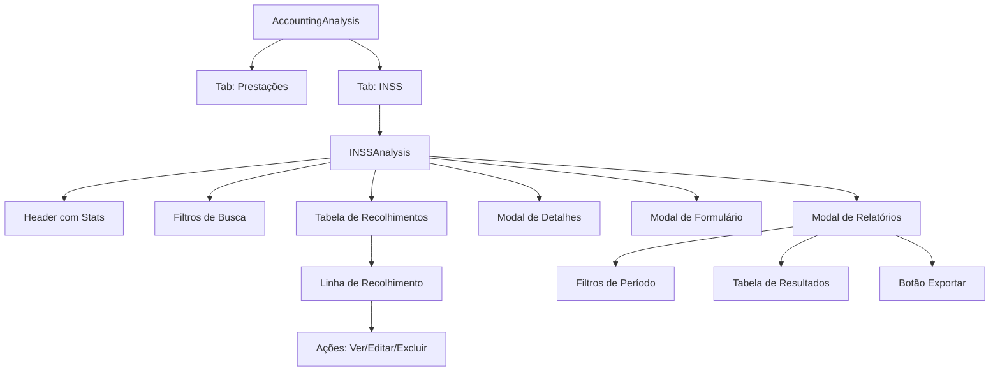
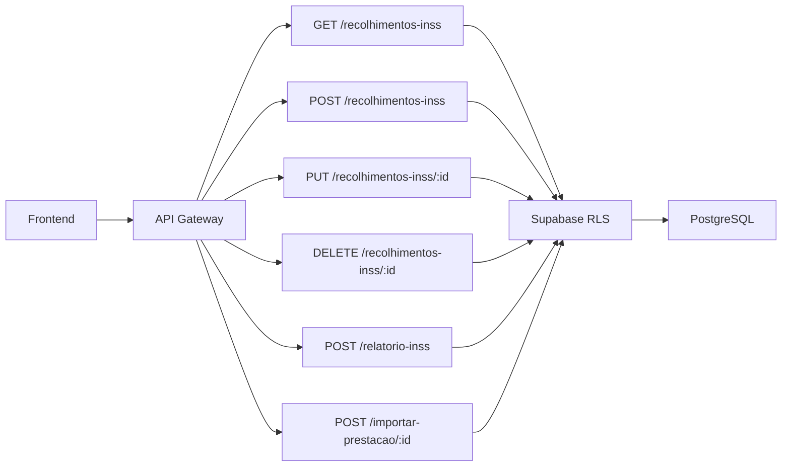
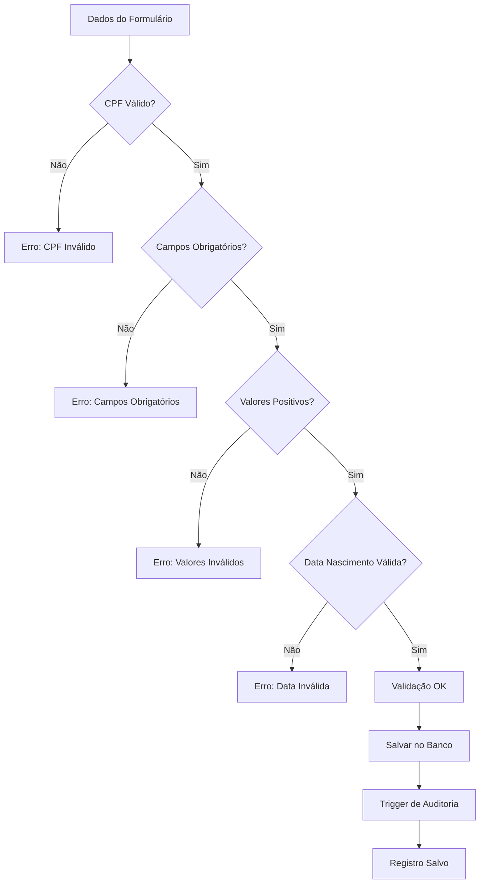
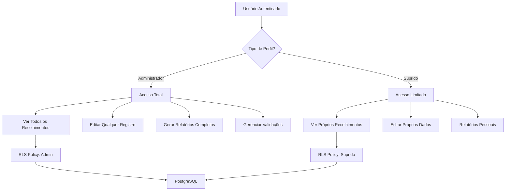
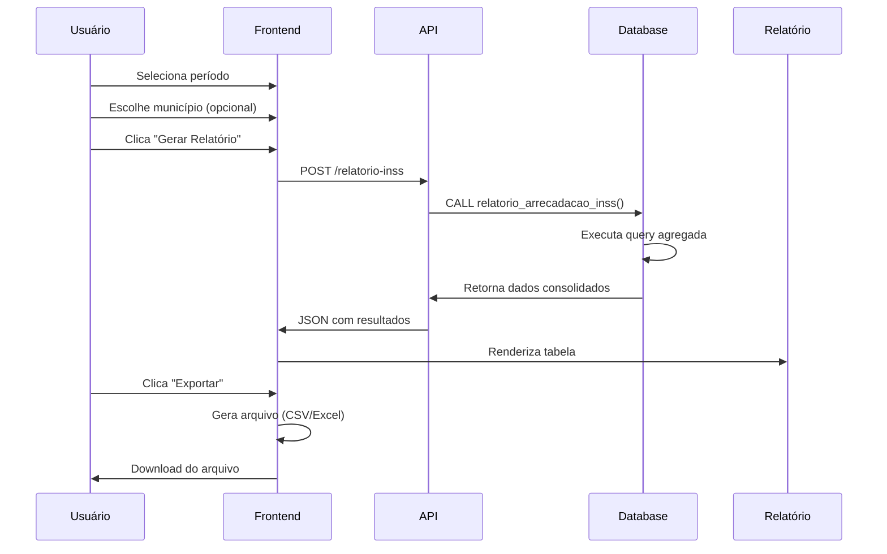
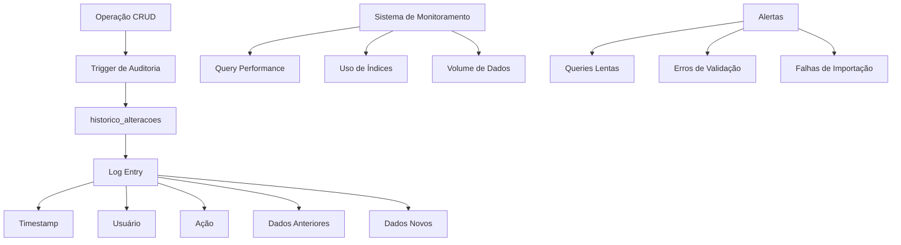

# Diagrama de Integração - Módulo INSS

## Fluxo de Dados Entre Módulos

## Relacionamentos de Entidades

## Fluxo de Importação de Dados

## Estrutura de Componentes React

## APIs e Endpoints

## Fluxo de Validação

## Segurança e Permissões

## Processo de Geração de Relatórios

## Monitoramento e Logs

Este diagrama de integração mostra como o módulo INSS se conecta com os demais componentes do sistema, garantindo a integridade dos dados e o fluxo correto de informações entre os módulos.